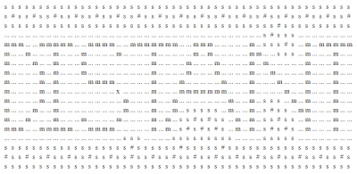

# distant-game
Contribution to the 13k javascript game coding competition 2021.

This is a turn based strategy game. Via the arrow keys you can move the across the map to build mines by pushing "m". Mines will provide supply which is necessary to attract space travellers settle near hubs "#". If you run out of supply. Settlements will be abandoned. Try to attract as many settlers as possible.

